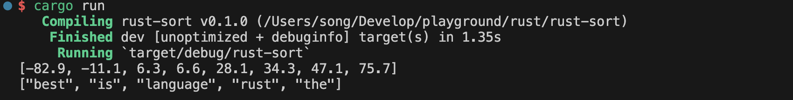
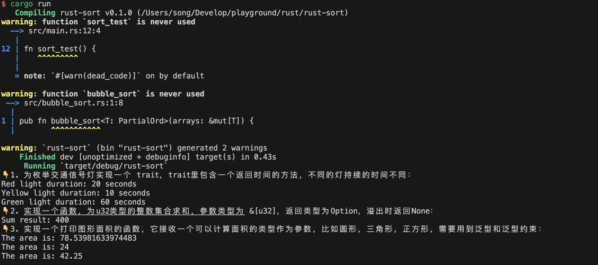

# lesson 3
## rust 冒泡排序
使用范型和PartialOrd实现对任意类型的排序，代码实现：

```rust
pub fn bubble_sort<T: PartialOrd>(arrays: &mut[T]) {
    let len = arrays.len();
    for i in 0..len {
        for j in 0..(len - i - 1) {
            if arrays[j] > arrays[j + 1] {
                arrays.swap(j, j + 1);
            }
        }
    }
}

fn main() {
    let mut arr = [28.1, 47.1, 6.6, 75.7, 34.3, 6.3, -82.9, -11.1];
    bubble_sort(&mut arr);
    println!("{:?}", arr);  // 输出：[-82.9, -11.1, 6.3, 6.6, 28.1, 34.3, 47.1, 75.7]
    let mut words = ["rust", "is", "the", "best", "language"];
    bubble_sort(&mut words);
    println!("{:?}", words); // 输出：["best", "is", "language", "rust", "the"]
}
```

## 运行结果


# lesson 4
## 1. 为枚举交通信号灯实现一个 trait，trait里包含一个返回时间的方法，不同的灯持续的时间不同：
```rust
trait TrafficLight {
  fn duration(&self) -> u32;
}

enum Signal {
  Red,
  Yellow,
  Green,
}

impl TrafficLight for Signal {
  fn duration(&self) -> u32 {
      match self {
          Signal::Red => 20,
          Signal::Yellow => 10,
          Signal::Green => 60,
      }
  }
}

pub fn light_duration() {
  let red_light = Signal::Red;
  let yellow_light = Signal::Yellow;
  let green_light = Signal::Green;

  println!("Red light duration: {} seconds", red_light.duration());
  println!("Yellow light duration: {} seconds", yellow_light.duration());
  println!("Green light duration: {} seconds", green_light.duration());
}
```
## 2. 实现一个函数，为u32类型的整数集合求和，参数类型为 &[u32]，返回类型为Option，溢出时返回None：
```rust
pub fn sum_numbers(numbers: &[u32]) -> Option<u32> {
  let mut sum: u32 = 0;
  for &num in numbers {
      match sum.checked_add(num) {
          Some(result) => sum = result,
          None => return None,
      }
  }
  Some(sum)
}
```
## 3. 实现一个打印图形面积的函数，它接收一个可以计算面积的类型作为参数，比如圆形，三角形，正方形，需要用到泛型和泛型约束：
```rust
pub trait Area {
  fn area(&self) -> f64;
}

pub struct Circle {
  pub radius: f64,
}

impl Area for Circle {
  fn area(&self) -> f64 {
      std::f64::consts::PI * self.radius * self.radius
  }
}

pub struct Triangle {
  pub base: f64,
  pub height: f64,
}

impl Area for Triangle {
  fn area(&self) -> f64 {
      0.5 * self.base * self.height
  }
}

pub struct Square {
  pub side: f64,
}

impl Area for Square {
  fn area(&self) -> f64 {
      self.side * self.side
  }
}

pub fn print_area<T: Area>(shape: T) {
  println!("The area is: {}", shape.area());
}
```
## 运行结果
